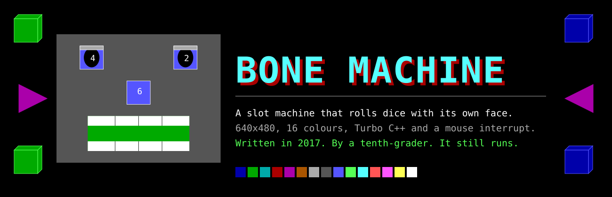
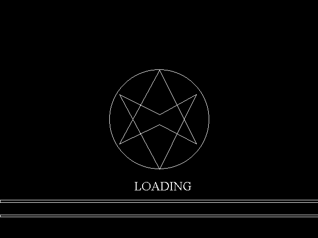
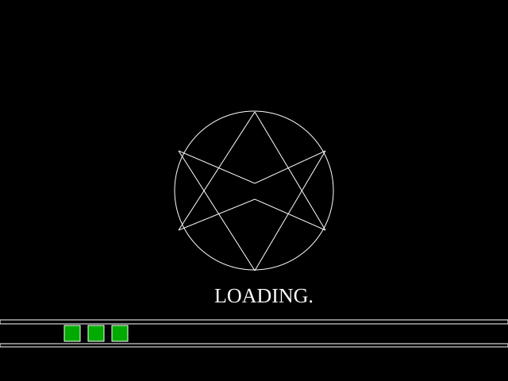
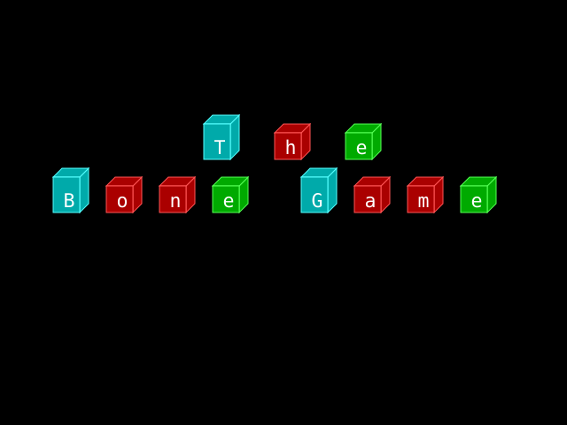
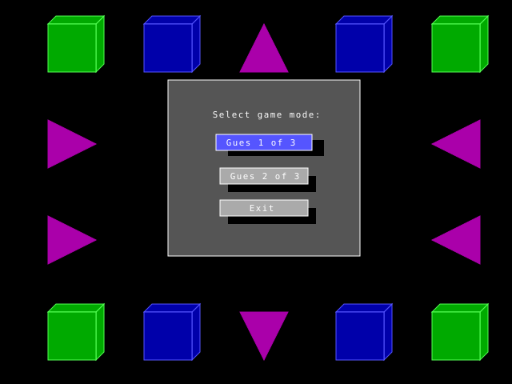
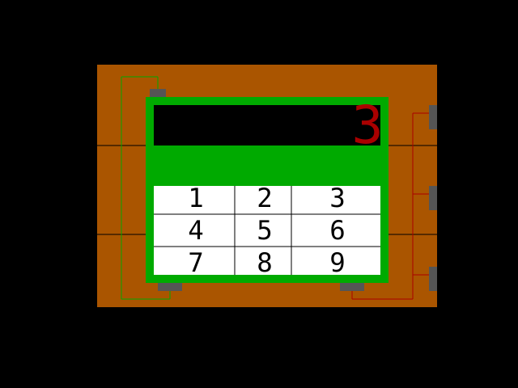
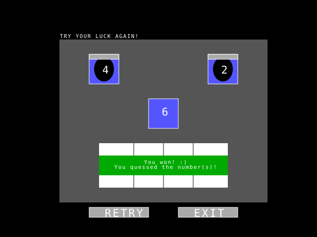
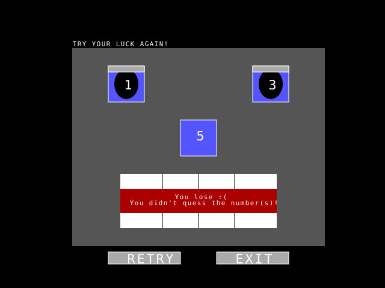
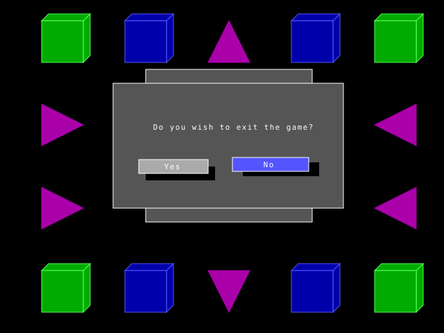
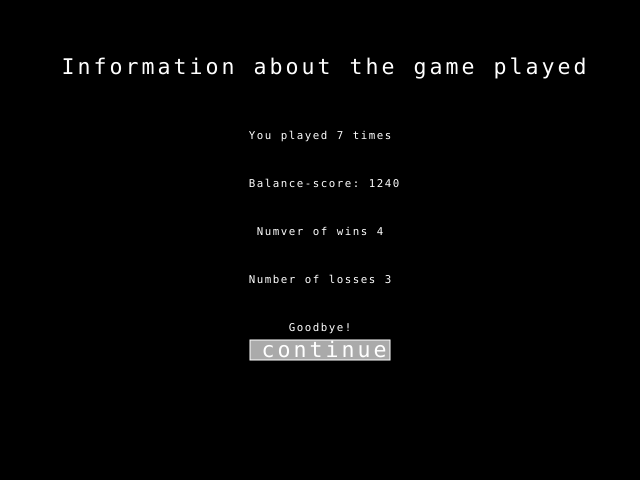

<p align="center">
  
</p>

<p align="center">
  <a href="LICENSE"></a>
  
  
  
  
</p>

<p align="center">
  <a href="README.md">English</a> · <b>Русский</b>
</p>

> Игровой автомат с лицом, написанный на C в Turbo C++ в 2017 году — десятиклассником, который
> ещё не знал, что функции умеют принимать аргументы. Вы ставите, называете число, брикет C4
> отсчитывает три секунды, и автомат бросает три кости **в собственных глазах и носу**.
> Код сохранён ровно таким, каким был, вместе с опечатками.

<p align="center">
  
</p>

## Быстрый старт

Игре нужна машина с DOS — значит, машину придётся принести с собой.

```
1.  Ставим DOSBox                     https://www.dosbox.com
2.  Распаковываем Turbo C++ 3.0 в     C:\TURBOC3        (внутри DOSBox)
3.  Кладём рядом BoneMachine.c, открываем в IDE и жмём Ctrl+F9
```

`initgraph()` ищет драйверы BGI в `c:\turboc3\bgi`, так что `EGAVGA.BGI` должен лежать именно
там — на этом спотыкаются все. Подробная инструкция, включая мышь и типовые ошибки:
**[docs/RUN.ru.md](docs/RUN.ru.md)**.

## Как устроена игра

Вы вводите начальный баланс, загадываете число от 1 до 6 и смотрите, что выпадет на трёх
костях. Кости не нарисованы костями — они появляются внутри лица автомата: по одной в каждом
зрачке и одна на носу. Угадали — рот зеленеет и скалится, не угадали — краснеет.

| Режим | Загадываете | Выигрыш, если | Шанс | Баланс |
|---|---|---|---|---|
| **Guess 1 of 3** | одно число | оно совпало хотя бы с одним из трёх бросков | 42,1% | `+150` / `−30` |
| **Guess 2 of 3** | два числа | любой бросок совпал с любым из них | 70,4% | `+150` / `−30` |

Что подводит нас к лучшему багу в этом репозитории.

### Казино в минусе

Выплаты жёстко зашиты: `+150` за победу, `−30` за поражение — и никто не сверил их с
вероятностями. Первый режим выигрывает в 1 − (5/6)³ = 42,1% случаев, то есть математическое
ожидание раунда — **плюс 45,8 фишки игроку**. Второй режим при двух разных числах выигрывает
в 1 − (4/6)³ = 70,4% случаев: **плюс 96,7 за раунд**.

Автомат настроен не против вас, а за вас, и обыграть его нельзя — можно только заскучать.
Шестнадцатилетний я построил казино, которое платит за аренду.

## Экраны

Каждый экран ниже восстановлен напрямую по координатам вызовов BGI из исходника: те же
`bar3d`, `line` и `outtextxy`, что и в коде. Это не снимки из эмулятора и не ретушь.
Единственная вольность — шрифт: вместо растрового 8×8 из BGI подставлен обычный моноширинный,
на той же восьмипиксельной сетке.

<table>
<tr>
<td width="50%"></td>
<td width="50%"></td>
</tr>
<tr>
<td><b>Загрузка.</b> Восемь линий расходятся внутри окружности и схлопываются обратно, три раза
подряд — просто потому, что у настоящих программ бывает экран загрузки.</td>
<td><b>Заставка.</b> Одиннадцать цветных блоков разбросаны по экрану, а затем перерисованы в
строй. Надпись 2017 года — <code>The Bone Game</code>, и она остаётся как есть.</td>
</tr>
<tr>
<td></td>
<td></td>
</tr>
<tr>
<td><b>Меню.</b> Самодельные кнопки с тенями и подсветкой под курсором, управление и стрелками,
и мышью. Опечатка в <code>Gues</code> живёт здесь с 2017 года.</td>
<td><b>Отсчёт.</b> Каждый раунд начинается с подрыва брикета C4: три, два, один, жёлтый
<code>BOOM</code>, красный <code>BOOM</code>.</td>
</tr>
<tr>
<td></td>
<td></td>
</tr>
<tr>
<td><b>Победа.</b> Рот заливается зелёным, восемь зубов вырезаны из него белыми
прямоугольниками.</td>
<td><b>Поражение.</b> Тот же рот, красный. Вся система анимации — нарисовать прямоугольник
поверх старого.</td>
</tr>
<tr>
<td></td>
<td></td>
</tr>
<tr>
<td><b>Выход.</b> Панель пошире поверх того же фона; кнопки растут и уменьшаются, когда
подсветка переходит между <code>Yes</code> и <code>No</code>.</td>
<td><b>Статистика.</b> Сыграно раундов, итоговый баланс, победы, поражения. Единственный экран,
где текст из <code>printf</code> и графика BGI делят место.</td>
</tr>
</table>

## Что внутри кода

| | |
|---|---|
| Один файл | `BoneMachine.c`, 1344 строки, ни одного собственного заголовка |
| Функции | 15 — `main` и ещё 14, причём одиннадцать вообще без аргументов |
| Комментарии | 196 строк с комментарием, а лексика сползает в транслит: `Graphics_Fon` — это «фон», `punkt` — пункт меню |
| Графика | только примитивы BGI: `bar3d`, `line`, `floodfill`, `outtextxy` |
| Мышь | `int86(0x33, …)` — прерывания DOS напрямую, опрос раз в 30 мс |
| Навигация | `goto`. Семь меток. Это конечный автомат, если прищуриться |
| Версия | 6.0, в шапке стоит `18/05/2017 · 21:39` |

Триста шестьдесят семь строк `main()` — это меню, нарисованное трижды, по разу на каждый
подсвеченный пункт, потому что так оказалось проще, чем хранить индекс выбора. Каждый переход между экранами
— это `goto` внутрь чужого цикла. Читаться это не должно, но почему-то читается.

Подробный разбор — обработка прерываний, модель перерисовки, граф из `goto` и те места, которые
сделаны действительно неплохо, — в **[docs/CODE-TOUR.ru.md](docs/CODE-TOUR.ru.md)**.

## Что я сделал бы иначе

Это не список сожалений, а список вещей, которым код учит тем, что делает их трудным путём.

- **`goto` вместо состояния.** Три раскладки меню скопированы одна в одну, по разу на каждую
  подсветку, и связаны метками. Один `int selected` и цикл перерисовки заменили бы всё это.
- **Два режима, один алгоритм.** `Game_Mode_1` и `Game_Mode_2` — по 240 строк каждый, и
  отличаются одним `scanf` и одним `||`. Это примерно треть программы, написанная дважды.
- **Шесть `case`, чтобы напечатать одну цифру.** У `switch(Random1 = random(6)+1)` есть ветка
  на каждую грань, и каждая зовёт `outtextxy` со своим строковым литералом.
- **Всё глобальное.** `balance`, три броска, загаданные числа и индекс меню лежат на уровне
  файла — поэтому функциям не нужны параметры, и поэтому их невозможно протестировать.
- **`Mouse_Regs()` объявлена как `int` и не возвращает ничего.** Turbo C++ это пропустил. Я тоже.
- **Никто не посчитал вероятности.** См. выше: заведение теряет около 46 фишек за раунд.

## Портирование

`graphics.h` и `dos.h` — борландовские, поэтому GCC и Clang это не соберут: менять придётся и
вызовы отрисовки, и мышь на `int86`. Зато получается приятный проект на вечер — вся игра это
15 функций и одно разрешение экрана.

Если вы перенесёте её на SDL2, raylib, WebAssembly или что угодно ещё — заводите issue или PR,
ссылка появится прямо здесь. Порты — единственный вклад, которого этот репозиторий ждёт;
код 2017 года остаётся нетронутым.

## Лицензия

[MIT](LICENSE) — берите, учитесь, используйте.

<details>
<summary>Лицензия, которая была здесь раньше</summary>

<br>

**Nostalgia Public License v1.0**

- **Можно:** ностальгировать, улыбаться, вспоминать 2016 год.
- **Можно:** использовать код для обучения — и как пример, и как предостережение.
- **Можно:** показать друзьям и сказать «а это мой первый код!».
- **Нельзя:** всерьёз критиковать шестнадцатилетнего меня.

Заменена лицензией MIT выше — у той есть преимущество: она существует.

</details>

---

<p align="center">
  <sub>Версия 6.0 · 18/05/2017 · 21:39 · автор — <a href="https://github.com/IAMN1">IAMN1</a><br>
  <i>«Если эта программа работает, то её написал IAMN1. Если нет, то не знаю, кто её написал.»</i><br>
  — комментарий в шапке файла, 2017</sub>
</p>
